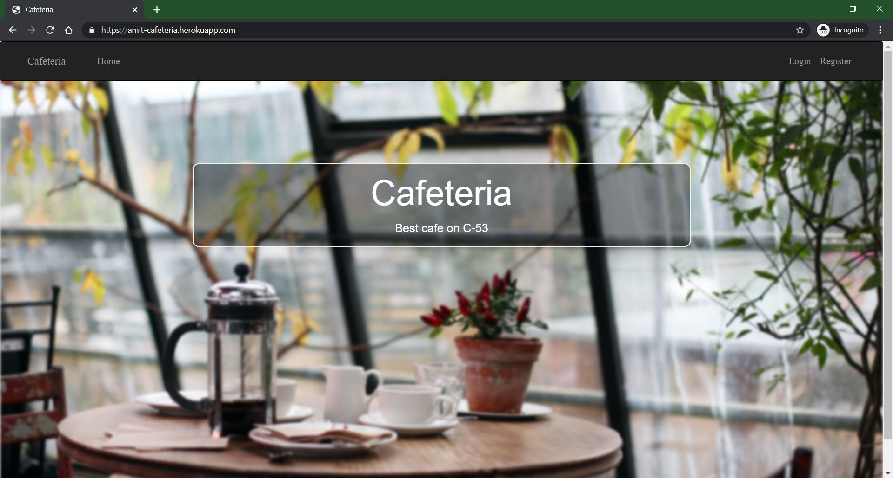

# Cafeteria Management

### This is a cafeteria management system built on `Rails`
It has support of different user types
* Customer
* Admin
* Billing Clerk

#### URL to the website
[Amit's Cafeteria](https://amit-cafeteria.herokuapp.com/)

#### Credentials
* Admin
    * email :=> admin@cafe.com
    * password :=> 123

* Clerk
    * email :=> clerk@cafe.com
    * password :=> 123

* Customer
    * email :=> customer@gmail.com
    * password :=> 123

#### `Functionalities available for a customer`
* Add items to cart

* Place an order

* View the status of Current and Previous Orders

#### `Functionalities available for an Admin`

* Add / Delete / Edit any Menu
* Set an active menu

* View currently pending orders and deliver them

* View sales records of desired time range

* Add / Remove any user(clerk, admin, customer)

#### `Functionalities available for a clerk`

* Can take walk-in orders
* Can deliver any pending order

#### URL to the website
[Amit's Cafeteria](https://amit-cafeteria.herokuapp.com/)
